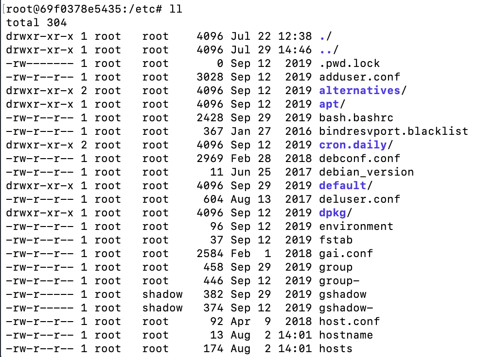

# 1 ls

* 含义

````markdown
list
````

* 使用方法

````markdown
ls
ls 文件名｜目录名
ls [参数] 文件名｜目录名
````

* 参数

````markdown
无参：非隐藏【文件｜目录】，以【文件｜目录】名排序，（todo: 颜色显示待确认）
-a: 全部文件，包括 隐藏文件， ./ 以及 ../
-A: 全部文件，包括隐藏文件，但不包括 ./ 和 ../
-d: 仅仅列出【目录｜文件】本身，即./或文件自己
-f: 直接列出结果（取消默认的排序以及颜色效果）
-F: 显示类型。* 可执行文件，/ 目录，= socket文件，｜ FIFO文件
-h: 文件大小以kb,mb等易读方式显示
-i: 列出inode号码
-l: 列出详细信息
-n: 用UID和GID替换用户名和用户群组
-r: 将排序结果反向输出
-R: 将子目录内容一起列出来
-S: 用文件大小排序
-t: 用时间排序
--color=never|always|auto: 【不｜总是｜根据设置】显示颜色
--full-time: 完整时间模式
--time=atime|ctime: 用【访问时间｜状态时间】替换默认的修改时间
--time-style "+%Y-%m-%d %H:%M:%S": 指定日期格式
````

**tips: 每个文件夹都有两个默认字目录， ./ 和 ../，一个指向自己，一个指向上级目录**

* ll每列的含义

````markdown
第一列：文件属性
第二列：文件硬链接数或目录子目录数
第三列：文件或目录拥有者
第四列：表述所属的组
第五列：文件大小
第六列：创建日期
第七列：文件名
````

**tips: ll 本质是 ls -l 的简写**

